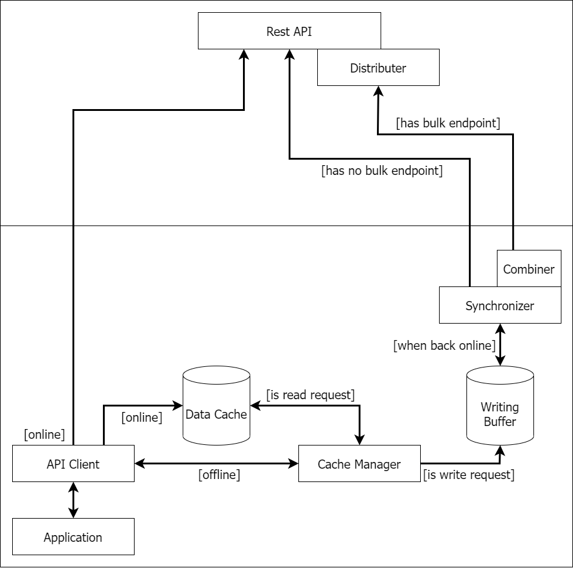

# Offline Webapp Research

Research on how web-apps may persist to still work even when offline. This repository will guide you through an example implementation of the solution that we found.

## Problem

TODO

## Solution

The diagram below shows our solution for the problem.

## Guide

This part will show you where you can find the implementation of our idea. In the `client` folder you will find a Vue Application that implements a basic product register where new products can be added. This Vue Application makes requests to a simple REST API provided in the `server` folder.

All the front-end implementations of the idea from the diagram above can be found in `src/client/cache`. `ApiClient.js` provides an implementation of an API client that uses our cache implementation. It can be used to make requests that automatically benefit from the idea described above. `CacheManager.js` is a JavaScript file that provides the cache used in the ApiClient. This CacheManager on the other hand uses the IndexedDB database from modern WebBrowsers, for which you can find an abstraction in `Database.js`. This allows the database to be interchangeable so that you can also use other types of client databases, for example the LocalStorage API. For this the implementation of the Database can be updated.

The only back-end implementation, that is not necessary for the dummy application, can be found in `src/router/sync.ts`, in which a dummy bulk request endpoint is implemented. This however only sends the single requests again so that it may be better to implement this part according to your own business logic.
